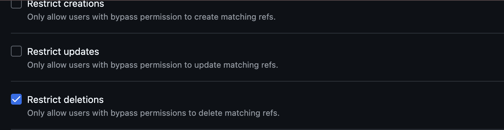
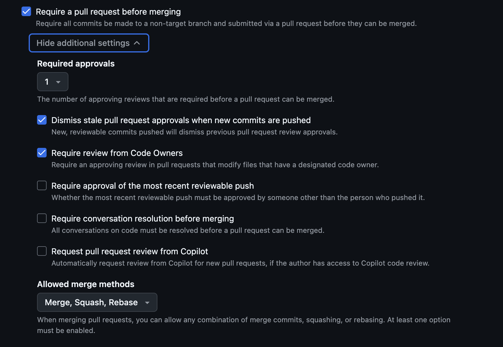

## Step 1: GitHub Rulesets
- Go to your repository
- Click on setting
- On the left pane find Rules
- Click on Rules and expend it and find rulesets

## Step 2: Repository Ruleset

**Ruleset Name** 

- main 

**Enforcement status** 

- Active

**Bypass List:**  

- Add bypass on the right side
- Check box the Repository Admin Role
- It makes a bypass list to Always allow
- Then click on 3 horizontal lines and checkbox for pull request only.

**Target Branches:**  

- Include: Default Branch

**Rules**
Check box the below items:

1. **Restrict Deletions**

2. **Require a Pull Request Before Merging**
 - **Required Approvals:** 1.
 - **Dismiss Stale Approvals:** Enabled (approvals are dismissed when new commits are pushed).

3. **Block Force Pushes** 

