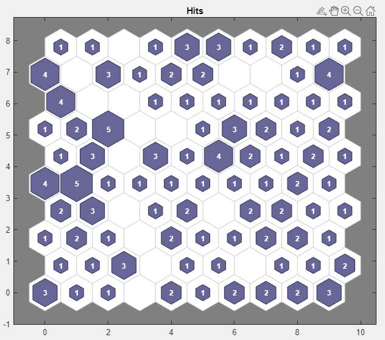

# Capstone Proposal
## Multi-Agent LLM and LangGrapgh for Complex Document Analysis
### Proposed by: Dr. Amir Jafari
#### Email: ajafari@gwu.edu
#### Advisor: Amir Jafari
#### The George Washington University, Washington DC  
#### Data Science Program

## 1 Objective:  
 
            The goal of this project is to develop an advanced multi-agent system using Large Language Models (LLMs) to 
            solve complex tasks involving the analysis and synthesis of information from diverse document sources. The system will:

            1. Utilize a language graph architecture to represent and process information efficiently.
            2. Implement multiple specialized LLM agents, each trained for specific tasks such as:
               - Document classification and routing
               - Information extraction from various document types (e.g., academic papers, legal documents, financial reports)
               - Summary generation
               - Cross-document fact-checking and verification
               - Query understanding and response generation
            3. Develop a coordination mechanism for agent interaction and task delegation.
            4. Create a unified interface for submitting complex queries and tasks to the system.
            5. Implement a result synthesis module to combine outputs from multiple agents into coherent responses.
            6. Ensure scalability to handle large volumes of documents and complex multi-step tasks.
            7. Incorporate explainability features to provide insight into the system's decision-making process.

            The end product will be a powerful, flexible system capable of understanding, analyzing, and synthesizing
             information from diverse document sources to solve intricate, multi-faceted problems.
            

*Figure 1: Caption*

## 2 Dataset:  

            The project will utilize a diverse range of document types from various sources to train and test the 
            multi-agent system. Datasets may include:

            1. Academic papers from arxiv.org and other open-access repositories
            2. Legal documents and case law from public legal databases
            3. Financial reports and SEC filings from company websites and financial databases
            4. News articles from reputable news outlets
            5. Government reports and policy documents
            6. Technical documentation and user manuals
            7. Social media posts and discussions (respecting privacy and terms of service)
            8. Open-source datasets like SQuAD for question-answering tasks

            Students will need to curate a balanced and representative dataset for each agent's specific task, ensuring 
            diversity in content, structure, and complexity. Proper attention must be given to licensing and usage 
            rights for all data sources.
            

## 3 Rationale:  

            In today's information-rich world, the ability to efficiently process, analyze, and synthesize knowledge from
             diverse sources is crucial. This project addresses several key needs:

            1. Automation of complex information processing tasks that typically require human expertise
            2. Enhancement of decision-making processes by providing comprehensive, multi-source analysis
            3. Improvement of information retrieval and synthesis in fields such as research, law, finance, and policy-making
            4. Advancement of AI technologies in natural language processing and multi-agent systems
            5. Development of scalable solutions for handling large volumes of unstructured text data
            6. Creation of more intuitive and powerful tools for knowledge workers and researchers

            By developing this multi-agent LLM system, students will contribute to the cutting-edge of AI and natural 
            language processing, potentially revolutionizing how complex information is processed and analyzed across 
            various industries and academic fields.
            

## 4 Approach:  

            The project will be approached through several key steps:

            1. Research and Planning:
               - Study existing multi-agent systems and LLM architectures
               - Analyze language graph implementations and their applications
               - Define the specific roles and capabilities of each agent

            2. Data Collection and Preprocessing:
               - Gather diverse document datasets for each agent's specialization
               - Develop preprocessing pipelines for different document types
               - Implement data augmentation techniques if necessary

            3. Language Graph Development:
               - Design and implement a flexible language graph structure
               - Develop algorithms for efficient information representation and retrieval within the graph

            4. Individual Agent Development:
               - Fine-tune LLMs for each specialized task (e.g., document classification, information extraction)
               - Implement task-specific processing pipelines for each agent
               - Develop evaluation metrics for individual agent performance

            5. Multi-Agent Coordination System:
               - Design and implement a coordination mechanism for agent interaction
               - Develop protocols for task delegation and information sharing between agents
               - Create a central controller for managing complex multi-step tasks

            6. Query Interface and Result Synthesis:
               - Develop a user-friendly interface for submitting complex queries
               - Implement a result synthesis module to combine outputs from multiple agents
               - Create visualization tools for presenting complex results

            7. Integration and System Architecture:
               - Combine all components into a cohesive system architecture
               - Implement APIs for potential integration with external systems
               - Ensure scalability through efficient resource management and parallel processing

            8. Testing and Optimization:
               - Conduct thorough testing with diverse, complex queries and document sets
               - Optimize performance, focusing on accuracy, speed, and resource utilization
               - Implement iterative improvements based on test results

            9. Explainability and Transparency:
               - Develop features to provide insights into the system's decision-making process
               - Implement logging and tracing mechanisms for each step of complex tasks

            10. Documentation and Deployment:
                - Create comprehensive documentation for the system architecture and individual components
                - Prepare a deployment strategy, considering potential cloud-based implementations
            

## 5 Timeline:  

            This is a rough timeline for the project:

            - (2 Weeks) Research and Planning
            - (3 Weeks) Data Collection and Preprocessing
            - (4 Weeks) Language Graph Development
            - (5 Weeks) Individual Agent Development
            - (3 Weeks) Multi-Agent Coordination System
            - (3 Weeks) Query Interface and Result Synthesis
            - (3 Weeks) Integration and System Architecture
            - (3 Weeks) Testing and Optimization
            - (2 Weeks) Explainability and Transparency Features
            - (1 Week)  Documentation
            - (1 Week)  Final Presentation and Project Wrap-up
            

## 6 Expected Number Students:  

            Given the complexity and scope of this project, it is suitable for a team of 4-5 students. The multi-faceted
             nature of the system allows for effective task distribution, promoting collaborative learning and development 
             across various aspects of AI and NLP.
            

## 7 Possible Issues:  

            Several challenges may arise during the project:

            1. Complexity of Integration: Ensuring seamless interaction between multiple specialized agents and the language graph.
            2. Scalability: Managing computational resources effectively when processing large volumes of documents and complex queries.
            3. Accuracy and Consistency: Maintaining high accuracy across diverse document types and complex, multi-step tasks.
            4. Language Graph Efficiency: Designing an efficient graph structure that balances comprehensive representation with quick retrieval.
            5. Agent Specialization vs. Generalization: Striking the right balance between highly specialized agents and maintaining overall system flexibility.
            6. Explainability: Developing meaningful explanations for the system's decisions, especially for complex multi-agent interactions.
            7. Ethical Considerations: Ensuring the system respects privacy, copyright, and ethical use of information.
            8. Handling Ambiguity: Developing robust methods to deal with ambiguous queries or conflicting information across documents.
            9. Performance Optimization: Balancing the trade-off between result quality and response time for complex queries.
            10. Evaluation Metrics: Defining comprehensive metrics to assess the system's performance on complex, multi-faceted tasks.

            Students will need to research and implement solutions to these challenges, which will be an integral part of the learning experience and contribute significantly to the project's innovation.
            

## Contact
- Author: Amir Jafari
- Email: [ajafari@gmail.com](Eamil)
- GitHub: [https://github.com/amir-jafari/Capstone](Git Hub rep)
