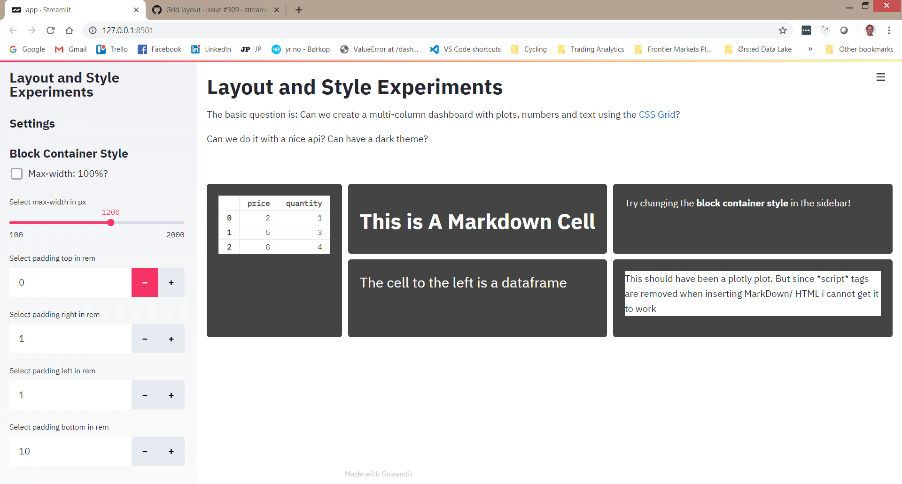

# Capstone Proposal
## Neural Network Design Streamlit App 
### Proposed by: Dr. Amir Jafari
#### Email: ajafari@gwu.edu
#### Advisor: Amir Jafari
#### The George Washington University, Washington DC  
#### Data Science Program

## 1 Objective:  
 
            The goal of this project is to convert all the Neural Network Design Demos from Pyqt to streamlit App. 
            Currently all the demos are in pyqt environment and can be installed by pip (https://pypi.org/project/nndesigndemos/).
            In the project, you job is is converting All the current demos which is written in python and uses pyqt widgets to 
            Streamlit webapp. And then create a container that can be deployed in the web domain. The final product is using the 
            demos by providing a user a link that opens up a webpage and all the demos will be accessed through internet.
            

*Figure 1: Caption*

## 2 Dataset:  

            No Dataset is needed for this project .  
            

## 3 Rationale:  

            This project is going to help students to use the Neural Network book demos in web format and it would easier for students 
            to access them. This is project is educational case that helps Neural Network Community to understand Neural Network
            in more conceptual way.
            

## 4 Approach:  

            I plan on approaching this capstone through several steps.  

            1. Familiarize yourself with Streamlit environment.
            2. Design the web layout with 2 books and all the chapters.  
            3. Create a modular widgets can be used across all the chapters (Reusable).
            4. Create a documentation from the begging till the end of the product.
            5. After all demos is done, testing it in local machine.
            6. Create the container that can be used in deployment.
            7. Deploy it on a server that can be accessed over the internet. 
            

## 5 Timeline:  

            This a rough time line for this project:  

            - (1 Weeks) Streamlit environment.  
            - (2 Weeks) Web layout  
            - (1 Weeks) Modular widgets  
            - (4 Weeks) Convert all the demos 
            - (2 Weeks) Container  
            - (2 Weeks) Web Deployment
            - (2 Weeks) Documentation
            

## 6 Expected Number Students:  

            For this project maximum 2 students can work on it.  
            

## 7 Possible Issues:  

            The challenge is on creating modular widgets and create a same layout as the book. Also, web deployment and
            containerizing it is also another challenge. 
            

## Contact
- Author: Amir Jafari
- Email: [ajafari@gmail.com](Eamil)
- GitHub: [https://github.com/amir-jafari/Capstone](Git Hub rep)
