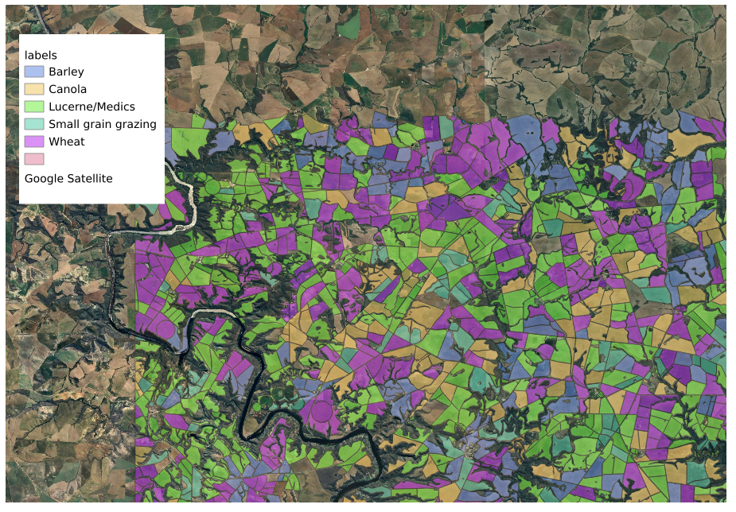

# Capstone Proposal
## Land Cover Classification comparing Deep Learning and Traditional Machine Learning
### Proposed by: Prof. Michael Mann
#### Email: mmann1123@gwu.edu
#### Advisor: Amir Jafari
#### The George Washington University, Washington DC  
#### Data Science Program

## 1 Objective:  
 
            The goal of this project is to explore and compare different approaches to classification under varying degrees of data scarcity. 
            The project will cover:

            1. Automated Feature Extraction: Utilized spfeas and xr_fresh to retrieve temporal and spatial features from satellite imagery.

            2. Traditional Machine Learning: Implement classical machine learning models such as Random Forest, SVM, and KNN on the

            3. Deep Learning: Utilize deep learning models such as RNNs, and transformers to classify land cover from satellite imagery.

            4. Comparison under constraints: Evaluate the performance of each approach under varying degrees of data scarcity

            

*Figure 1: Caption*

*Figure 2: Caption*

## 2 Dataset:  

            Students will utilize a bands from Sentinel-2 satellite imagery to classify land cover. 

            1. Land cover classes are obtained from field boundaries / land cover types from a radiant earth challenge https://github.com/AI4EO/tum-planet-radearth-ai4food-challenge
            
            2. Time Series Data: Sentinel-2 satellite imagery for multiple time points, which can be used for time series analysis.
            We will applly the module xr_fresh to extract time series features from the satellite imagery. (e.g. trends, seasonality etc).

            3. Cross-sectional Data: Extracted features from the Sentinel-2  satellite imagery using the spfeas module. 
            This provides a set of spatial features that can be used for traditional machine learning models 
            (e.g. texture, line length etc).

            

## 3 Rationale:  

            There has been some discussion in the literature about the effectiveness of deep learning models compared to traditional
            machine learning models in the context of data scarcity. This project will provide students with the opportunity to
            explore this question in the context of land cover classification, a critical task in remote sensing and environmental
            monitoring. By comparing the performance of classical machine learning models with deep learning models under varying
            degrees of data scarcity, students will gain insights into the strengths and limitations of each approach.
            

## 4 Approach:  

            The project will be divided into several key phases:

            1. Feature Generation: Sentinel 2 satellite imagery has already been collected for the study area. Students will use
                spfeas and xr_fresh to extract spatial and temporal features from the satellite imagery. 

            2. Feature extraction:
                - Feature data will be extracted for all fields with training data, based on polygon boundaries.

            3. Model Training:
                - Students will train classical machine learning models (e.g., Random Forest, SVM, KNN) on the extracted spatial features.
                - Students will train deep learning models (e.g., RNNs, transformers) on the extracted temporal features.

            3. Model Comparison:
                - Analyze the performance of each model using appropriate metrics (e.g., RMSE, MAE for time series; R², MSE for regression).
                - Compare and contrast the outcomes to draw conclusions about the strengths and limitations of each approach.

            4. Evaluation and Reporting:
                - Document the findings and present a comprehensive comparison between classical and modern approaches.
            

## 5 Timeline:  

            This is a rough timeline for the project:

            - (2 Weeks) Dataset Selection and Familiarization
            - (4 Weeks) Time Series Modeling with Classical Techniques
            - (4 Weeks) Implementation of Transformer-Based Models
            - (4 Weeks) Regression Analysis on Tabular Data
            - (3 Weeks) Model Comparison and Evaluation
            - (2 Weeks) Final Reporting and Presentation
            

## 6 Expected Number Students:  

            Given the scope of work and the need to explore multiple datasets and modeling techniques, this project is suitable 
            for a team of 2-3 students.
            

## 7 Possible Issues:  

            Potential challenges include:

            1. Data Preprocessing: Ensuring datasets are correctly preprocessed for both time series and tabular data analysis.
            2. Model Complexity: Understanding the complexities of deep learning models and ensuring they are correctly implemented.
            3. Comparative Analysis: Developing a robust framework for comparing classical models with transformer-based approaches.
            4. Computational Resources: Managing the computational demands of training large transformer models.
            

## Contact
- Author: Amir Jafari
- Email: [ajafari@gmail.com](Eamil)
- GitHub: [https://github.com/amir-jafari/Capstone](Git Hub rep)
